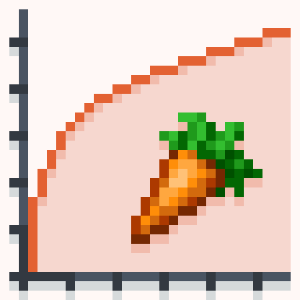

	

A mod designed to encourage dietary variety! It does so by **rewarding** the player for eating a variety of foods instead of **punishing** them for failing to diversify. Instead of using the stick we use the carrot!

This mod is not a fork of Spice of Life, although it is named similarly as it is a similar concept, but reversed in terms of the effects!

#### Features

The mod keeps track of how many unique foods a player has eaten. As they pass certain milestone amounts of unique foods, they permanently gain new hearts, increasing their max health! In order to max out their HP bars, players will have to quest for and craft exotic foods.

This mod comes with a custom config to set the player's starting hearts (which can be less than 10 if desired) as well as the number of unique foods they need to eat until they reach each milestone. The number of hearts per milestone is also configurable.

The default configuration allows a player to go from 10 to 20 hearts by eating most non-poisonous foods in vanilla Minecraft. However, it is mostly designed for modpack authors who want to add Pam's HarvestCraft or other food mods to their modpack, because it adds interest and incentivizes players to explore a complex cooking system. Finally, the niche "chef" players of the Minecraft world will have a place of honor next to the miners and engineers!

In order to track your progress, SoL: Carrot offers a handy book called the Food Book, crafted simply by combining a book and a carrot in any shape. This book offers a visualization of your overall progress, as well as lists of the foods you have and have not eaten. (The latter can be disabled in config.)

#### Notes
- The pre-1.14 versions of this mod require [AppleCore](https://www.curseforge.com/minecraft/mc-mods/applecore).
- In post-1.12, Forge switched to a new config system, which means SoL: Carrot has two places to configure it now. The client-side configs (like visual options) are in the regular `config` folder and aren't synced between server and client. The server-side configs (like milestones or the blacklist) are stored in a serverconfig folder within each save and synced to the client. You can provide default values for these by placing a copy in the `defaultconfigs` folder, i.e. at `defaultconfigs/solcarrot-server.toml`.

#### Commands
This mod also features 3 commands:
- /foodlist size  
Tells you the number of unique foods you've eaten, as well as and how many more you need to eat until your next milestone.
- /foodlist clear  
Clears the stored list of unique foods a player has eaten and resets their heart count. This is useful for testing when editing the config or when you want to start over.
- /foodlist sync  
Forces a sync of the food list to the client, for when something went wrong and it's mismatched.

If you want to talk to the developers of this mod, join our [Discord server](https://discord.gg/JZzD4EQ)!

If you're enjoying my mods, check out my patreon (click the text below) or donate in the top right corner, everything helps!
[Become a Patron!](https://www.patreon.com/cazsius)

